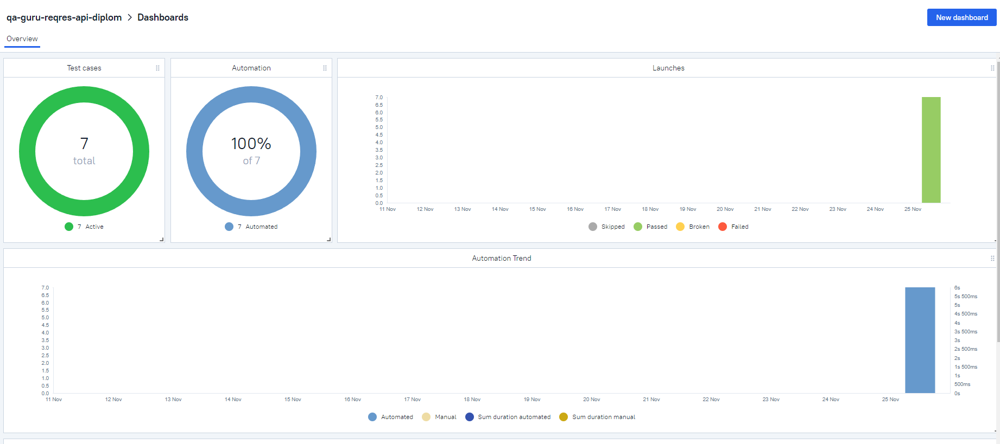

# Дипломный проект по тестированию API для [reqres.in](https://reqres.in/)

## :open_book: Содержание

- [Технологии и инструменты](#gear-технологии-и-инструменты)
- [Реализованныe проверки](#heavy_check_mark-тест-кейсы)
- [Запуск тестов из терминала](#computer-запуск-тестов-из-терминала)
- [Запуск тестов в Jenkins](#-запуск-тестов-в-jenkins)
- [Отчет о результатах тестирования в Allure Report](#-отчет-о-результатах-тестирования-в-Allure-report)
- [Интеграция с Allure TestOps](#-интеграция-с-allure-testops)
- [Уведомления в Telegram](#-уведомления-в-telegram)

## :gear: Технологии и инструменты

<p align="left">
<a href="https://www.jetbrains.com/idea/"></a>
<a href="https://www.java.com/"></a>
<a href="https://github.com/"></a>
<a href="https://junit.org/junit5/"></a>
<a href="https://gradle.org/"></a>
<a href="https://github.com/allure-framework/allure2"></a>
<a href="https://www.jenkins.io/"></a>
<a href="https://web.telegram.org/"></a>
<a href="https://qameta.io/"></a>
</p>

## :heavy_check_mark: Тест кейсы

- Получение списка пользователей
- Проверка наличия пользователя в базе
- Создание нового пользователя
- Обновление данных пользователя
- Успешная регистрация
- Проверка id, email пользователя
- Проверка email пользователя при помощи Groovy

## :computer: Запуск тестов из терминала

### Локальный запуск тестов

```bash
./gradlew clean api
```

##  Запуск тестов из [Jenkins](https://jenkins.autotests.cloud/job/qa-guru-reqres-diplom/)
Для запуска сборки необходимо нажать кнопку <code><strong>*Build with Parametrs*</strong></code>.

<p align="center">
  
</p>

После выполнения сборки, в блоке <code><strong>*Build history*</strong></code> напротив номера сборки появится
значок *Allure Report* и *Allure TestOps* кликнув по которому, откроется страница с сформированным html-отчетом и тестовой документацией.

##  Отчет о результатах тестирования в [Allure Report](https://jenkins.autotests.cloud/job/qa-guru-reqres-diplom/allure/)

<p align="center">
  
</p>

<p align="center">
  
</p>

##  Интеграция с [Allure TestOps](https://allure.autotests.cloud/project/3849/dashboards)

### Основной дашборд

<p align="center">
  
</p>

### Список тестов с результатами прогона

<p align="center">
  
</p>

### Тест-кейсы

<p align="center">
  
</p>

##  Уведомления в Telegram
После завершения сборки специальный бот, созданный в <code>Telegram</code>, автоматически обрабатывает и отправляет сообщение с отчетом о прогоне тестов.

<p align="center">

